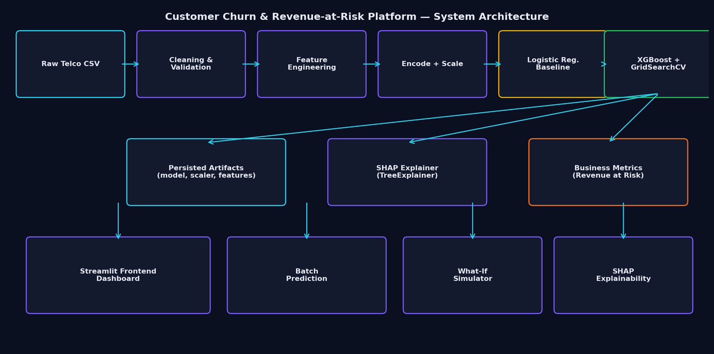

# Customer Churn & Revenue-at-Risk Analytics Platform

> Predict customer churn, quantify revenue at risk, and prescribe retention plays — built on the IBM Telco Customer Churn dataset, powered by **XGBoost** and **SHAP**, served through a polished **Streamlit** UI.



## Overview

This is a production-grade analytics platform that turns a churn dataset into an
executive-ready decision tool. It ships with a trained XGBoost model, SHAP-based
explainability, and an interactive Streamlit front-end designed for business users.

## Features

- 📊 **Executive Dashboard** with KPIs, revenue-at-risk segmentation, and interactive Plotly charts
- 📥 **Batch Prediction** for CSV upload with schema validation, drift detection (PSI), and CSV export
- 🧪 **What-If Analysis** with live churn-probability simulation, gauge charts, and SHAP updates
- 🧠 **SHAP Explainability** — global, dependence, and individual force/waterfall plots
- 💰 **Business Metrics** — annual revenue at risk, expected retention savings, CLV approximation
- 🛡️ **Production hygiene** — caching, session state, structured logging, exception handling
- 🧰 **Modular ML pipeline** — preprocessing, feature engineering, training, evaluation as importable modules

## Tech Stack

`Python 3.11` · `Streamlit` · `Pandas` · `NumPy` · `Scikit-learn` · `XGBoost` ·
`SHAP` · `Plotly` · `Matplotlib` · `Seaborn` · `Joblib` · `Imbalanced-learn` · `ReportLab`

## Project Structure

```
customer-churn-platform/
├── app/
│   ├── pages/                # Streamlit multipage app
│   ├── utils/                # preprocessing, features, prediction, SHAP, business
│   └── Home.py
├── training/                 # train.py, evaluate.py, config.py
├── models/                   # serialized model + scaler + metrics
├── data/raw/                 # IBM Telco CSV
├── notebooks/                # EDA + modeling walkthrough
├── assets/                   # logo, hero, architecture diagram
├── streamlit_app.py          # Streamlit Cloud entry point
├── requirements.txt
├── runtime.txt
└── .streamlit/config.toml
```

## ML Pipeline

1. **Ingest** raw IBM Telco CSV.
2. **Clean** — coerce `TotalCharges`, normalize `SeniorCitizen`, strip whitespace.
3. **Feature engineering** — `tenure_bucket`, `services_count`, `charges_per_tenure`, `avg_monthly_spend_category`, `auto_payment_flag`.
4. **Encode + scale** — one-hot for categoricals, `StandardScaler` for numerics.
5. **Train** — Logistic Regression baseline + XGBoost with `GridSearchCV` (5-fold) and `scale_pos_weight` for class imbalance.
6. **Evaluate** — Accuracy, Precision, Recall, F1, ROC-AUC, PR-AUC, confusion matrix.
7. **Threshold** — pick optimum via Youden's J statistic.
8. **Persist** — `models/churn_model.pkl`, `scaler.pkl`, `feature_columns.pkl`, `metrics.json`, `threshold.json`.
9. **Serve** — Streamlit pages consume artifacts via cached resources.

## Installation

```bash
git clone <your-repo-url>
cd customer-churn-platform
pip install -r requirements.txt
```

The repository ships with a pre-trained model in `models/`. To retrain:

```bash
python training/train.py
```

## Run locally

```bash
streamlit run streamlit_app.py
```

Open <http://localhost:8501>.

## Deploy to Streamlit Cloud

1. Push the repo to GitHub.
2. Go to <https://share.streamlit.io> → **New app**.
3. Pick your repo, branch, and set the entry point to `streamlit_app.py`.
4. Streamlit Cloud reads `requirements.txt` and `runtime.txt` automatically.
5. Click **Deploy**.

## Business Impact

- Quantifies **annual revenue at risk** at customer and segment level.
- Identifies **top-decile high-risk customers** that drive most of the churn loss.
- Produces **prescriptive retention plays** (contract upgrade, auto-pay migration, premium support bundle).
- Estimates **retention savings** assuming a configurable success rate.

## Future Improvements

- Survival analysis (Kaplan–Meier / Cox PH) for time-to-churn modelling.
- Uplift modelling to target retention spend at the most persuadable customers.
- Realtime scoring API (FastAPI) and feature store (Feast).
- A/B test instrumentation for retention campaigns.

## License

MIT.
